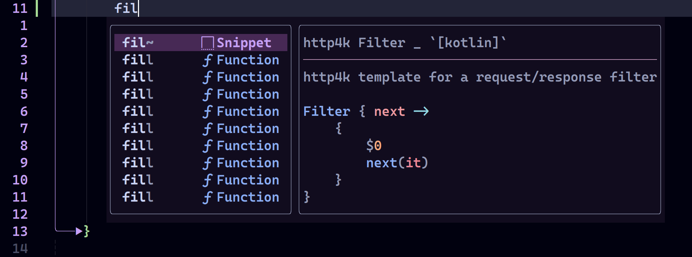

<h1 align="center">LuaSnip snippets for select Kotlin libraries</h1>



<p align="center">
    <a href="https://github.com/neovim/neovim/releases/tag/v0.10.1">
      </a>
    <a href="https://github.com/L3MON4D3/LuaSnip/releases/tag/v2.3.0">
      </a>
    <a href="https://github.com/JetBrains/kotlin/releases/tag/v2.0.20">
      </a>
    <a href="https://github.com/franckrasolo/luasnip4k.nvim/blob/trunk/LICENSE">
      </a>
</p>

[luasnip4k.nvim](https://github.com/franckrasolo/luasnip4k.nvim) is a Neovim plugin
providing [LuaSnip](https://github.com/L3MON4D3/LuaSnip) snippets for an _opinionated_
selection of Kotlin libraries only.

Starting with [http4k](https://www.http4k.org/), it will eventually cover
_some_ of the foundational libraries of [forkhandles](https://github.com/fork-handles/forkhandles)
as the need arises.

The initial `http4k` snippets cover the same ground _and_ are functionally identical
to these [live templates](https://github.com/http4k/intellij-settings#how-to-use-the-live-templates)
for IntelliJ IDEA.

Of particular note, _**required import statements are automatically inserted**_
if they are not already present in the active Neovim buffer.

## 📦 Installation

For [lazy.nvim](https://lazy.folke.io/), simply configure this plugin as follows:

```lua
return {
  "franckrasolo/luasnip4k.nvim"
}
```

## 🚀 Available Snippets

In all snippets below, the underscore character `_` indicates the position of
the cursor immediately after a snippet is expanded.

<details>
<summary><code>IntelliJ IDEA / JetBrains Fleet</code></summary>

> We refer you to JetBrains Fleet's
> [List of Kotlin live templates](https://www.jetbrains.com/help/fleet/live-templates-list-kotlin.html)
> as `luasnip4k.nvim` already supports most of them out of the box.

</details>

<details>
<summary><code>http4k</code></summary>

### General

|  Trigger   | Expands to                            | Description                            |
| :--------: | ------------------------------------- | -------------------------------------- |
|  `fil`     | `Filter { next -> { _; next(it) } }`  | Template for a request/response filter |
|  `hh`      | `{ req: Request -> Response(OK)_ }`  | Snippet for a request/response handler |

### Requests

|  Trigger   | Expands to               | Description                      |
| :--------: | ------------------------ | -------------------------------- |
| `head`     | `Request(HEAD, "/_")`    | Template for a `HEAD` request    |
| `get`      | `Request(GET, "/_")`     | Template for a `GET` request     |
| `post`     | `Request(POST, "/_")`    | Template for a `POST` request    |
| `put`      | `Request(PUT, "/_")`     | Template for a `PUT` request     |
| `delete`   | `Request(DELETE, "/_")`  | Template for a `DELETE` request  |
| `options`  | `Request(OPTIONS, "/_")` | Template for a `OPTIONS` request |
| `trace`    | `Request(TRACE, "/_")`   | Template for a `TRACE` request   |
| `patch`    | `Request(PATCH, "/_")`   | Template for a `PATCH` request   |
| `purge`    | `Request(PURGE, "/_")`   | Template for a `PURGE` request   |

### Responses

|  Trigger   | Expands to                      | Description                       |
| :--------: | ------------------------------- | --------------------------------- |
| `100`      | `Response(CONTINUE)_`           | Snippet for a HTTP `100` response |
| ...        |                                 |                                   |
| `202`      | `Response(ACCEPTED)_`           | Snippet for a HTTP `202` response |
| ...        |                                 |                                   |
| `307`      | `Response(TEMPORARY_REDIRECT)_` | Snippet for a HTTP `307` response |
| ...        |                                 |                                   |
| `401`      | `Response(UNAUTHORIZED)_`       | Snippet for a HTTP `401` response |
| ...        |                                 |                                   |
| `504`      | `Response(GATEWAY_TIMEOUT)_`    | Snippet for a HTTP `504` response |
| ...        |                                 |                                   |

</details>
